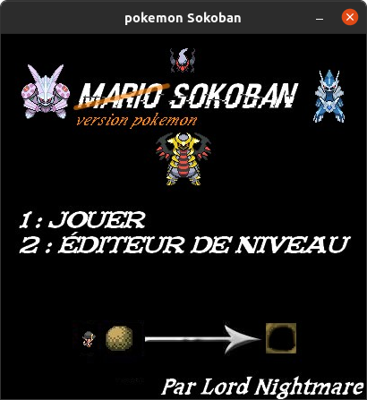
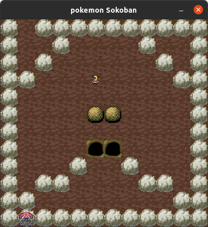
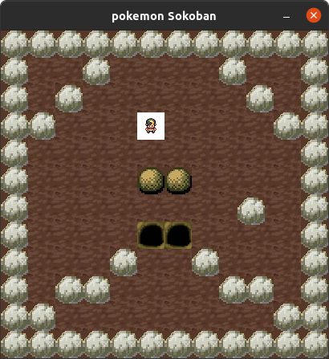

# Sokoban (2017)

Inspired by Mathieu Nebra course on Openclassroom at https://openclassrooms.com/fr/courses/19980-apprenez-a-programmer-en-c

## Goal 
Put all the rocks in the holes.
This project contains an editor to create your own levels.

## Gameplay element
A random legendary pokemon spawn at a random place. (it's useless but it's fun)

## Screenshots
Menu :

Game mode :

Editor mode :

## Author

+ ln-dev05

## Credits 
All graphics are the property of Nintendo. But the use I have of them is purely educational and will not bring me any profit. ( So Nintendo if you see this please be nice )